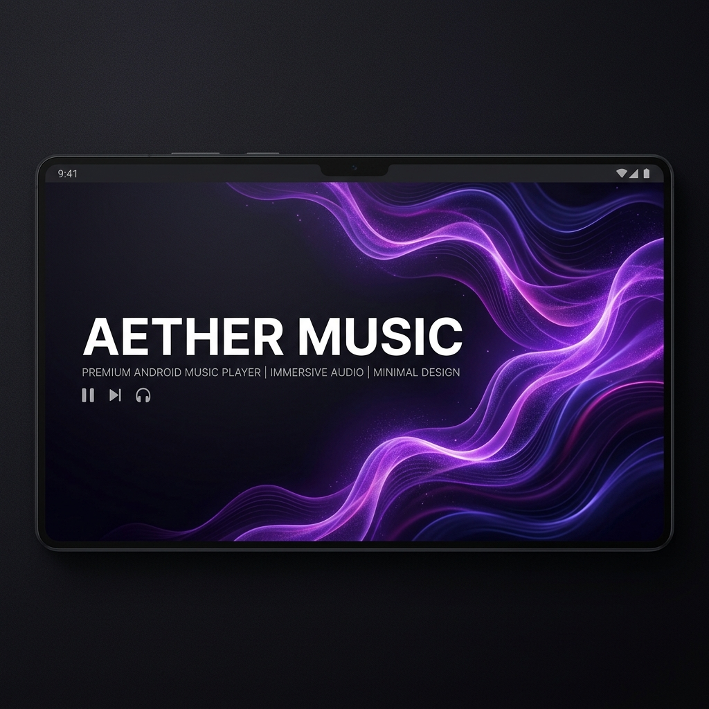

<div align="center">
  <h1>Aether Music</h1>

  <p><strong>A premium, atmospheric, and minimal Android music application built for users who value control, personalization, privacy, and performance.</strong></p>

  [](https://android.com)
  [](https://kotlinlang.org)
  [](https://developer.android.com/jetpack/compose)
  [](LICENSE)
  [](https://github.com/bharadwajsanket/Aether-Music/releases)

  <p align="center">
    
  </p>
</div>

---

## 1. Overview

AETHER Music is a modern Android music player built with Jetpack Compose. It combines local playback, streaming, downloads, synchronized lyrics, customization, and privacy-focused features with a premium visual experience.

Inspired by a blend of Apple Music and Nothing OS aesthetics, it leverages a unified design system of spacing scales, custom haptic feedback rhythms, and OLED-optimized interfaces without compromising on performance or offline capabilities.

### Current Status

⚠️ **Active Development**

AETHER Music is currently undergoing a major rebrand and UI overhaul. Features, UI components, and build configurations may change rapidly.

---

## 2. Features

### 🎵 Playback
* **Local Playback**: High-performance local library scanning and file playback.
* **Queue Management**: Dynamic playback queue management with drag-and-drop reordering.
* **Offline Downloads**: Search, stream, and cache/download audio locally for completely network-free offline playback.

### 💬 Lyrics
* **Synced Lyrics**: Synchronized, word-by-word scrollable lyrics view.
* **AI Translation**: Real-time translation of foreign language lyrics.
* **Multi-Provider Support**: Robust integrations with lyrics providers such as LrcLib, BetterLyrics, and more.

### 🎨 Personalization
* **Dynamic Themes**: UI styling dynamically shifts based on current playing album art.
* **Pure Black Mode**: A high-contrast black settings and player skin tailored for OLED screens.
* **Haptic Customization**: Fine-grain controls to adjust tactile click vibration triggers across player components.

### 🌐 Connectivity
* **Spotify Playlist Import**: Search and import Spotify playlists directly into the local Room database.
* **Listen Together**: Sync playback session with other devices to listen together in real time.

### 📐 Design
* **AETHER Design System**: Spacing, corner, and sizing scales applied systematically for high layout harmony.
* **Atmospheric UI**: Spacious UI with clean paddings, card overlays, and smooth transitions.
* **Adaptive Icon System**: Vector-based adaptive launcher icons conforming to monochrome themed settings.

---


## 4. Installation

Official releases can be found under the **Releases** tab of the GitHub repository. 
1. Go to the [Releases](https://github.com/bharadwajsanket/Aether-Music/releases) page.
2. Download the latest `AetherMusic-3.5.4-Universal.apk` or GMS variant.
3. Install the APK on your Android device (enabling installation from unknown sources if required).

---

## 5. Build Instructions

### Prerequisites
* Android Studio (latest version recommended)
* Android SDK (API level 26+)
* JDK 21
* Git

### Step-by-Step Build
1. **Clone the Repository**
   ```bash
   git clone https://github.com/bharadwajsanket/Aether-Music.git
   cd Aether-Music
   ```
2. **Configure Local Properties**
   Create a `local.properties` file in the root directory:
   ```properties
   sdk.dir=/path/to/your/android/sdk
   ```
3. **Compile via Gradle**
   * To build the FOSS Debug variant:
     ```bash
     ./gradlew assembleUniversalFossDebug
     ```
   * To build the GMS Debug variant:
     ```bash
     ./gradlew assembleUniversalGmsDebug
     ```

### Known Build Notes
* **JDK 21** is strictly required to compile the Kotlin modules.
* **Android SDK API 26+** (Oreo) is the minimum SDK support.
* Some development branches may contain unstable build configurations.
* Release builds require `STORE_PASSWORD`, `KEY_ALIAS`, and `KEY_PASSWORD` process environment variables for signing.

---

## 6. Architecture

Aether Music is built following clean architecture guidelines:

### Module Structure
* `app/`: Main application module containing application components, Hilt DI setup, and global view models.
* `ui/`: Compose layout pages, components, standard theme colors, and visual styling tokens.
* `playback/`: ExoPlayer/Media3 player service integrations and audio session callbacks.
* `innertube/`: Network APIs for streaming audio metadata, search results, and charts.
* `database/`: Room database setup, migrations, DAOs, and data models.
* `network/`: Asynchronous client definitions using Ktor.
* `utils/`: Reusable extension functions, haptic controller integrations, and file handlers.

### Data Flow Direction
```
UI (Compose)
   ↓
ViewModel
   ↓
Repository
   ↓
Room Database / Network Sources
```

---

## 7. Roadmap

- [ ] Cross-device sync
- [ ] Wear OS support
- [ ] Backup & restore
- [ ] Improved Listen Together
- [ ] Advanced equalizer
- [ ] Material You integration
- [ ] iOS companion exploration

---

## 8. Credits

AETHER Music contains work derived from open-source projects and community contributions.

Special thanks to:
* Original project maintainers
* Open-source contributors
* Android and Compose communities

### Open Source Notice

This project builds upon previous open-source work and would not be possible without the original contributors.

---

## 9. License

This project is licensed under the **GNU General Public License v3.0** (GPL-3.0) - see the [LICENSE](LICENSE) file for details.
