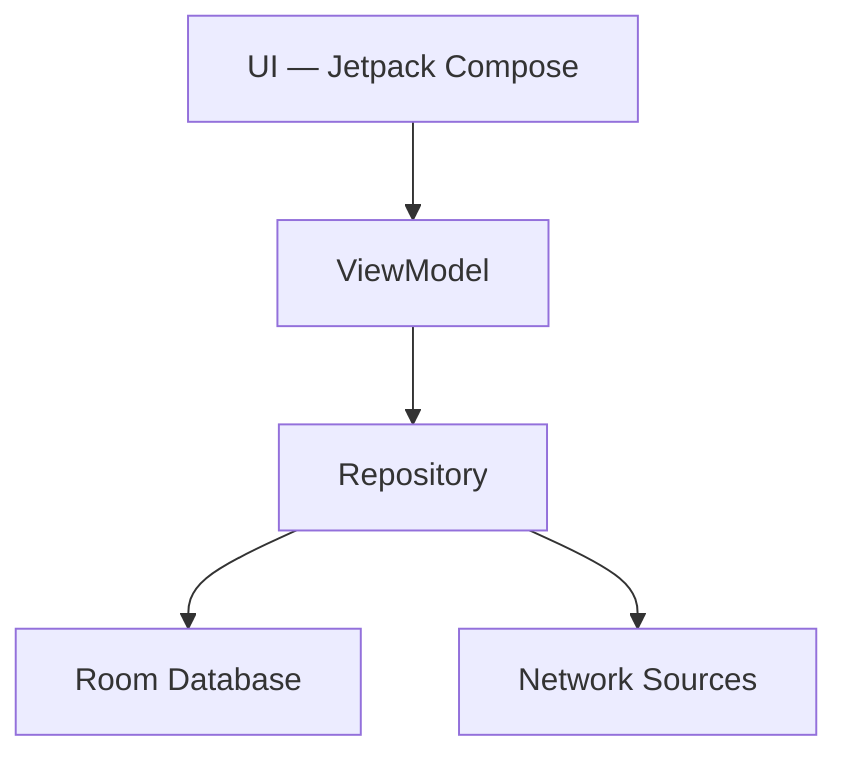

<div align="center">

# JUNO

### A calm, atmospheric music player for people who still want to listen.

<p>
  <em>Local-first. Privacy-respecting. Built without distraction in mind.</em>
</p>

<p>
  <a href="https://android.com"></a>
  <a href="https://kotlinlang.org"></a>
  <a href="https://developer.android.com/jetpack/compose"></a>
  <a href="LICENSE"></a>
  <a href="https://github.com/bharadwajsanket/juno/releases"></a>
</p>

<br>

[Overview](#overview) · [Why JUNO](#why-juno) · [Features](#features) · [Tech Stack](#tech-stack) · [Architecture](#architecture) · [Installation](#installation) · [Build](#build-instructions)

</div>

<br>

---

## Overview

JUNO is an Android music player built with Jetpack Compose, designed around one idea: **listening to music shouldn't feel like operating software.**

It plays your local library, streams when you want it to, downloads for offline use, and shows you synchronized lyrics — all wrapped in an interface that stays out of the way. Where most players compete for your attention with notifications, recommendations, and clutter, JUNO is built to recede into the background and let the music (and the moment around it) take over.

The headline feature of the v4.0 series is **Living Sky & Living Environment** — a procedural rendering engine that mirrors the real sky and weather outside your window, turning the now-playing screen into something closer to a window than a control panel.

> **Current status:** v4.1.1 — Stable, feature-complete.

### What's New in v4.1.1

- **OTA Overhaul:** Upgraded updater system with complete repository migration from the old `JUNO-Music` to the new `juno` repository.
- **Semantic Versioning:** Replaced lexicographical checks with a robust unlimited-segment semantic version comparison algorithm.
- **Robust Update Detection:** Added proper draft/pre-release checks, with dynamic APK selection matching the current ABI and GMS/FOSS build flavor.
- **Resumable Downloads:** Implemented HTTP range-based resuming of interrupted downloads and socket connection timeouts.
- **Installation Security:** Added APK signature/integrity check via Android's package manager and restricted installation paths to avoid traversal exploits.
- **Installer Recovery Fallback:** Added a manual APK share/install action option if default installation fails.
- **12-Hour Stale Cache & Offline Recovery:** Added stale cache expiration and fallback update details under offline mode with warning banners.
- **Enhanced Markdown Parser:** Upgraded markdown rendering to strip redundant bullets and parse multi-line headers and links cleanly.

<br>

---

## Why JUNO

Most music apps are designed to maximize engagement. JUNO is designed to do the opposite.

- **Calm over busy.** No infinite feeds, no autoplay traps, no manufactured urgency.
- **Local-first.** Your library lives on your device. Streaming and downloads are conveniences, not requirements.
- **Privacy by default.** Features like Living Sky use device GPS *locally* — your location never has to leave your phone for the sky outside to show up on your screen.
- **Thoughtful, not flashy.** Every animation, haptic, and transition exists to support the experience, not to show off.
- **Music before distraction.** The interface is built to disappear once a song starts playing.

JUNO isn't trying to be everything. It's trying to be a good place to listen.

<br>

---

## Features

### Experience
- **Living Sky Engine** — a procedural, weather-aware renderer that reflects the real sky and time of day outside your window, using local-only GPS data.
- **Procedural Environments** — five environment types (Ocean, Forest, Mountains, Meadow, Desert) that crossfade over 3 seconds as weather and time shift.
- **Volumetric Sun-Angle Shadows** — clouds cast soft shadows that skew dynamically opposite the sun's path overhead.
- **Rippling Waves & Reflections** — segmented reflections of the sun or moon warp naturally across water in response to wind and waves.
- **Rare Natural Events** — deterministic, occasional moments: birds crossing daytime clouds, fireflies on warm nights, shooting stars, partial rainbows, and lightning-lit clouds during storms.
- **Synced Wind System** — a single wind model that drives cloud drift, swaying grass and trees, rain angle, and snow drift together.
- **Reduce Motion Support** — fully respects system accessibility settings, freezing heavy motion (rain, snow, shooting stars) when requested.

### Playback
- High-performance local library scanning and playback.
- Dynamic queue management with drag-and-drop reordering.
- Offline downloads — search, stream, and cache audio for fully network-free listening.

### Lyrics
- Synchronized, word-by-word scrolling lyrics.
- Real-time AI translation for foreign-language lyrics.
- Multi-provider support, including LrcLib and BetterLyrics.

### Personalization
- Dynamic theming that shifts with the current album art.
- Pure Black Mode — a high-contrast skin tuned for OLED panels.
- Fine-grained haptic controls across player components.

### Connectivity
- Spotify playlist import, searched and saved directly into your local Room database.

### Design
- A unified spacing, corner, and sizing system applied consistently across the app.
- Spacious layouts with clean padding, card overlays, and smooth transitions.
- Vector-based adaptive launcher icons that respect monochrome theming.

<br>

---

## Tech Stack

| Layer | Technology |
|---|---|
| Language | Kotlin |
| UI | Jetpack Compose, Material 3 |
| Playback | Media3 / ExoPlayer |
| Persistence | Room |
| Networking | Ktor |
| Image Loading | Coil |
| Dependency Injection | Hilt |
| Concurrency | Kotlin Coroutines |
| Platform | AndroidX |

<br>

---

## Architecture

JUNO follows a clean, unidirectional architecture.



State flows down, events flow up — each layer depends only on the one beneath it.

<br>

---

## Module Structure

| Module | Responsibility |
|---|---|
| `app/` | App entry point, Hilt setup, and global view models. |
| `ui/` | Compose screens, components, theming, and design tokens. |
| `playback/` | Media3/ExoPlayer integration and audio session callbacks. |
| `innertube/` | Network APIs for streaming metadata, search, and charts. |
| `database/` | Room setup, migrations, DAOs, and data models. |
| `network/` | Ktor-based async client definitions. |
| `utils/` | Shared extensions, haptics, and file utilities. |

<br>

---

## Installation

1. Visit the [Releases](https://github.com/bharadwajsanket/juno/releases) page.
2. Download the latest `JUNO-4.1.1-Universal.apk` (or the GMS variant).
3. Install on your device, enabling installation from unknown sources if prompted.

<br>

---

## Build Instructions

### Prerequisites
- Android Studio (latest recommended)
- Android SDK, API level 26+
- JDK 17 or JDK 21
- Git

### Steps

**1. Clone the repository**
```bash
git clone https://github.com/bharadwajsanket/juno.git
cd juno
```

**2. Configure local properties**

Create a `local.properties` file in the project root:
```properties
sdk.dir=/path/to/your/android/sdk
```

**3. Build with Gradle**

GMS Release:
```bash
./gradlew assembleArm64GmsRelease
```

GMS Debug:
```bash
./gradlew assembleArm64GmsDebug
```

> **Note:** JDK 17/21 is required to compile the Kotlin modules. Minimum supported SDK is API 26 (Oreo).

<br>

---

## Performance

- **Native Compose rendering** — no legacy View interop overhead.
- **Local-first architecture** — playback and library access don't depend on the network.
- **OLED-aware design** — Pure Black Mode reduces power draw on supported panels.
- **Offline-capable by design** — downloaded audio plays with zero network dependency.
- **Battery-conscious updates** — environment rendering is tuned to avoid unnecessary redraws.
- **Accessibility-respecting animation** — Reduce Motion is honored system-wide, not bolted on.
- **Minimal background work** — the app stays quiet when it isn't actively playing.

<br>

---

## Roadmap

Planned, realistic improvements for future releases:

- Widget improvements
- Tablet-optimized layouts
- Continued UI refinements
- Ongoing performance tuning
- Additional accessibility enhancements

<br>

---

## Credits

JUNO builds on the work of the broader open-source ecosystem and would not exist without it.

Thanks to:
- The maintainers of the original project this work is derived from
- Open-source contributors whose code and ideas shaped JUNO
- The Android developer community
- The Jetpack Compose community

<br>

---

## License

Licensed under the **GNU General Public License v3.0**. See [LICENSE](LICENSE) for full details.

<br>

---

<div align="center">

**If JUNO made your listening a little calmer, consider giving it a star.**

<sub>Built with care, one release at a time.</sub>

</div>